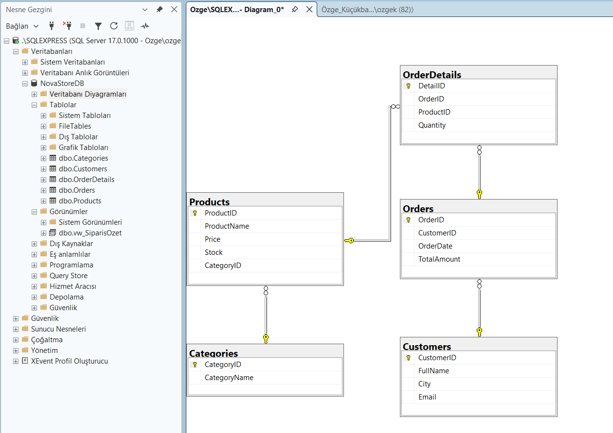

NovaStore SQL Database Project

This project is a relational database design for an e-commerce system.

📌 Features
- Database design (Categories, Products, Customers, Orders)
- Relationships with foreign keys
- Data insertion
- Advanced SQL queries (JOIN, GROUP BY, SUM)
- View creation
- Backup operations

🛠️ Technologies
- Microsoft SQL Server
- T-SQL

📊 ER Diagram

📄 Report
Detailed report is available in the PDF file.

---

NovaStore SQL Veri Tabanı Projesi

Bu proje, bir e-ticaret sistemi için ilişkisel veri tabanı tasarımını içermektedir.

📌 Özellikler
- Veri tabanı tasarımı (Kategori, Ürün, Müşteri, Sipariş)
- Yabancı anahtar ilişkileri
- Veri ekleme işlemleri
- Gelişmiş SQL sorguları (JOIN, GROUP BY, SUM)
- View oluşturma
- Yedekleme işlemleri

